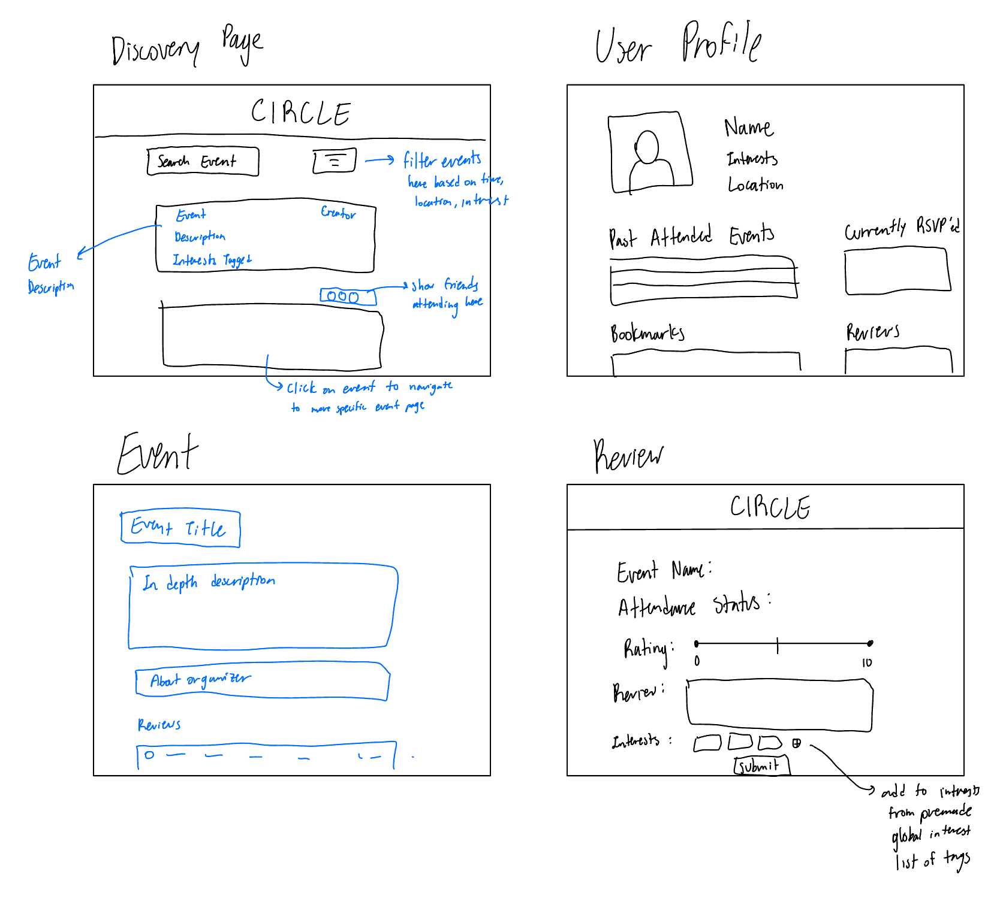

# Assignment 2

## Problem Statement

### Problem Domain

**Community Finding:** In a new city, it is challenging to build up a community in situations outside of a structured setting like college. Many cities have plenty of events and classes to go to, but it may be difficult to  narrow down which of them to follow through with. I would like to have one place to find events that may interest me and are recommended to me based on my current interests to meet more people after graduating.

### Problem

Key Problem: Any given city has tons of events to go to, and it is hard to select and track which ones would maximize enjoyment.

Title: Event Overload

In any given city, there might be too many events or communities that you belong to. It's easy to feel like you are missing out on events that you would have more fun at, or that you consistently pick events that aren't as enjoyable as expected. Instead, you feel like you wasted time, missed out on better connections, and lack a community that fits your interests. I selected this problem because I feel like finding events and activities in a new location is essential to building a community. For people that are moving to new cities, I believe there is a large need for finding a strong support system, and attending fun events is a convenient way to do so.

### Stakeholder List

**Event Organizers**

- Impact: The person in charge of organizing an event wants to maximize attendance while also considering potential limited resources; therefore, they want to identify users who would be most
interested in attending.

**City**

- Impact: The city benefits from having citizens who are happier since they will be likely to stay in the city for longer periods of time and contribute financially; its residents are more likely to be satisfied with their city if they have a strong community there.

**User**

- Impact: Individuals want to find events that maximize their personal enjoyment, and are less likely to go back to events that did not meet their needs nor expectations.

### Evidence and Comparables

1. Evidence: [After Graduating, Keep Community First](https://hbr.org/2013/05/after-graduating-keep-communit) An article on the importance of maintaining a community after graduating and beginning "adult life". Cites proximity, repeated exposure, and welcoming setting as 3 main factors to forge friendships.
2. Comparable: [Meetup](https://www.meetup.com/) A comparable where people can sign up to attend events based on hobbies together. However, paywalls make the service difficult to use and there are no features to check people into events in real time or add live updates for events.
3. Comparable: [Nextdoor](https://www.nextdoor.com/) A neighborhood posting forum to make connections and post about local news and services. It is more focused on neighborhood logistics instead of personal interests and hobbies that people may have in common, making it less useful for building community based on shared activities.
4. Comparable: [What are your biggest complaints with Eventbrite?](https://www.reddit.com/r/Eventbrite/comments/1l5vpr6/what_are_your_biggest_complaints_with_eventbrite/) Eventbrite doesn't allow users to filter only groups they are interested in, or have the ability to mark certain groups/events as "not interested" on the discover page. It lacks adequate personalization.
5. Evidence: [Developing a sense of place through attendance and involvement in local events: the social sustainability perspective](https://www.tandfonline.com/doi/full/10.1080/02508281.2024.2335749#d1e201) Study shows frequent attendance at local events leads to increased sense of place, implying the impact of local events strengthening the social sustainability of a community.
6. Evidence: [Defining Interested Non-Attendance and the Barriers to Attendance](https://www.arts.gov/impact/research/arts-data-profile-series/adp-4/defining-interested-non-attendance) People who wanted to attend an event but ultimately did not cite the following reasons: cost, could not find anyone to go with, access, lack of time, and losing interest in the event.

## Application Pitch

**Application Name:** Circle

Everyone all across the world needs a community to rely on, and what better way is there to do it than through events that match up with your favorite activities? Through Circle, you can easily find personalized events, meet new people, and help your community by leaving ratings and reviews on the quality of events for future upkeep. 

On the Discovery Page, you can easily access events recommended based on your interests, hobbies, and past ratings. Mark events as “interested” or “not interested” to improve your recommendations, and bookmark events so planners can gauge interest. 

Attend more and more events, and create Circle Connections as you go. Mutually add people as connections and track which events they plan to attend so you can go together!

Keep track of your experiences in the Event History page. When you mark your attendance, leave an anonymous rating and review, which is helpful for both yourself and event organizers who are looking to improve their event quality and turnout. Reflect on which events you enjoyed most and get tailored suggestions for future events. 

Get to know your community more through local events, and most importantly, expand your Circle! 

## Concept Design

### Concepts

**concept** UserProfile[Events]

**purpose** Store information relating to a user and easily access it, including their friends, interests, attended events, and reviews. Users can manage their profiles and interact with events in the system.

**principle** A user registers their account with a username and password. Once registered, they can manage their friends by adding or removing them. There is a global set of interests that a user can select from and add or remove from their profile when desired. As users, review, bookmark, and attend events, they are associated to the user with the ability to add or remove the connection.

**states**

    a set of Users with
        a username String
        a password String
        a set of friends Users
        a set of interests Strings
        a set of reviewID Strings
        a set of bookmarkedEventID Strings
        a set of attendedEventID Strings

    a set of GlobalInterests with
        a name String

**actions**

createUser (username: String, password: String): (user: User)

    requires: the username does not already exist in the system

    effects: a User instance is created with the associated username and password, and all sets of friends, reviews, and events (bookmarked, attended, or created) are initialized as empty.

deleteUser (user: User)

    requires: the user exists in our system

    effects: the user is removed from our system, and the associated username is also freed up for a future user to take up.

addFriend (user: User, friend: User): (friend: User)

    requires: the user and friend are both valid users in our system

    effects: The friend is added to the user's set of friends, and the user is added to the friend's set of friends. Return the user instance of the friend we have just added to the original user's set.

removeFriend (user: User, friend: User): (friend: User)

    requires: the user and friend are both valid users in our system

    effects: The friend is removed to the user's set of friends, and the user is removed to the friend's set of friends. Return the user instance of the friend we have just removed to the original user's set.

addInterest (user: User, interest: String)

    requires: the user is valid in our system, and the interest is included within the global set of interests that our system supports.

    effects: The interest is added to the user's set of interests.

removeInterest (user: User, interest: String)

    requires: the user is valid in our system, and the interest is included within the user's set of existing interests.

    effects: The interest is removed from the user's set of interests.

addBookmark (user: User, eventID: String)

    requires: the user is valid, the eventID exists, and the eventID is not already in the set of the user's bookmarkedEventIDs.

    effects: adds the eventID to the set of bookmarkedEventIDs for the given user.

removeBookmark (user: User, eventID: String)

    requires: the user is valid, the eventID exists, and the eventID is included in the set of bookmarkedEventIDs for the given user.

    effects: removes the eventID from the set of bookmarkedEventIDs for the given user.

addAttendedEvent (user: User, eventID: String)

    requires: the user is valid, the eventID exists, and the eventID is not already in the set of the user's attendedEventIDs.

    effects: removes the eventID from the set of attendedEventIDs for the given user.

removeAttendedEvent (user: User, eventID: String)

    requires: the user is valid, the eventID exists, and the eventID is included in the set of attendedEventIDs for the given user.

    effects: removes the eventID from the set of attendedEventIDs for the given user.

addReview (user: User, reviewID: String)

    requires: the user and reviewID are valid

    effects: ties the reviewID to the user

removeReview (user: User, reviewID: string)

    requires: the user and reviewID are valid, and the reviewID is linked to the given user

    effects: removes the link between the user and the given reviewID

**additional notes** Event IDs are treated as opaque identifiers; UserProfile does not require knowledge of the event concept implementation.

**concept** EventManagement[Event, User]

**purpose** Manage the creation, deletion, and modification for any events.

**principle** A user can create an event and provided relevant details including the event name, time, location, and description. Upon creation, the user is provided with an ID to identify the event with. The user who is organizing this event is the only person who can modify or cancel this event. Modifications can be made to any field of the selected event.

**states**

    a set of Events with
        a creatorID String
        an eventName String
        an eventTime Date
        an eventID String
        a location String
        an eventStatus EventStatus
        a description String
        a set of relevantInterests Strings

    a set of EventStatus with
        ACTIVE
        CANCELLED

    a set of GlobalInterests with
        a name String

**actions**

createEvent (creatorID: String, eventName: String, eventTime, Date, location: String, description: String, relevantInterests: Set of Strings): (eventID: String)

    requires: creatorID exists, eventTime has not already occurred, all relevant interests provided belong to the set of GlobalInterests provided in our system

    effects: Registers an event in the system with the given user as the creator, and generates a random string for the event ID that is not already associated to an existing event. Upon creation, sets the eventStatus to ACTIVE. Returns this event ID string.

deleteEvent (userID: String, eventID: String)

    requires: userID exists and is the creator for the given eventID, the eventID corresponds to an existing event, and the event has not already happened

    effects: deletes this event from our system and removes it from the creator's set of created events.

updateEventDetails (userID: String, eventID: String, eventTitle: String?, eventDate: Date?, location: String?, description: String?, relevantInterests: Set of Strings?)

    requires: userID and eventID exist in our system, such that the user is the creator for the event tied to the given eventID; at least one of the optional field has been provided (if eventDate, it must not have already occurred); all of the relevantInterests set items must belong to the GlobalInterests set of strings.

    effects: modifies the given event detail fields for the event corresponding to the given eventID.

updateEventStatus (userID: String, eventID: String, newStatus: EventStatus)

    requires: userID exists and is equivalent to the ID of the creator for the given eventID, and the eventID also exists in the system; newStatus is one of ACTIVE, CANCELLED

    effects: modifies the eventStatus for the event corresponding to eventID to be the value of newStatus.

**additional notes** Assuming that the user who originally created the event is the only person authorized to modify or cancel the existing the event once it is registered in the system. Any user is eligible to create an event. Maintaining a global list of strings for interest we can easily identify within our system. Event creators can tag their events with interests that algin well.

**concept** EventRecommendation[Event, User]

**purpose** Provide personalized and filtered event recommendations for users based on their interests and timing preferences, ensuring users discover relevant and upcoming events.

**principle** A user can receive recommendations based on the interests associated with them and the event. They can choose to filter the list of all possible events by location in addition to any given time frame in the future, as well as on an interest. Events are only considered as valid recommendations if they are active, meaning they have not been cancelled.

**states**

    a set of Events with
        an eventName String
        an eventTime Date
        an eventID String
        a location String
        an eventStatus EventStatus
        a description String
        a set of relevantInterests Strings

    a set of EventStatus with
        ACTIVE
        CANCELLED

    a set of GlobalInterests with
        a name String

    a set of Users with
        a userID String
        a set of Interests Strings

**actions**

getRecommendedEvents (userID: String, location: String): (eventIDs: Set of Strings)

    requires: userID is valid and tied to an existing user

    effects: returns a set of eventIDs for events set in the given location with an ACTIVE status based on overlap between the user's set of interests and the events' set of relevant interests provided.

filterEventsByInterest (userID: String, location: String, interest: String): (eventIDs: Set of Strings)

    requires: userID is valid and linked to an existing user, interest is a valid string included in our global set of interests, 

    effects: returns a set of eventIDs for events set in the given location with an ACTIVE status that include the given interest in their sets of relevant interests, sorted chronologically.

filterEventsByTime (userID: String, location: String, startTime: Date, endTime: Date): (eventIDs: Set of Strings)

    requires: userID is valid and linked to an existing user, startTime < endTime, neither of which have happened yet.

    effects: returns a set of eventIDs for events set in the given location with an ACTIVE status between the given time frame, sorted in chronological order.

**concept** EventParticipation[Event, User]

**purpose** Track event participation for users, including information on when they rsvp to an event, attend, and do not attend.

**principle** A user can RSVP to an event before attending. They can undo this RSVP if they change their mind. They may also choose to bookmark it, or remove a bookmark if it has already been set. Once the time of the event has past, they can set whether they attended the event or did not show up. If they attended the event, they may optionally add a review. They may delete their review or modify it. 

**states**

    a set of Participations with
        a userID String,
        an eventID String,
        a participationStatus ParticipationStatus
        bookmarked Flag
        a reviewID String?

    a set of ParticipationStatus with
        RSVP
        ATTENDED
        NO_SHOW

**actions**

addRsvp (userID: String, eventID: String)

    requires: userID and eventID exist, the user must not be rsvp'ed to the given event nor have any participation status set

    effects: sets the participation status for the given userID associated to the eventID to be RSVP

removeParticipation (userID: String, eventID: String)

    requires: userID and eventID exist, the participation status for the given user ID is set to a non-null value for this eventID

    effects: removes any eventParticipation tied between the pair of the given userID and eventID

markOfficialAttendance (userID: String, eventID: String, participationStatus: participationStatus)

    requires: userID and eventID exist such that there is a user with the user ID and there is an event with the event ID; there does not need to be an existing participation status set, but the given participation status must be either ATTENDED or NO_SHOW

    effects: sets the participation status for the userID and eventID to the given status value

addBookmark (userID: String, eventID: String)

    requires: userID and eventID exist in the system, and there is no existing bookmark

    effects: sets the bookmarked value for the userID and eventID to be true

removeBookmark (userID: String, eventID: String)

    requires: userID and eventID exist in the system, and there is an existing bookmark

    effects: sets the bookmarked value for the userID and eventID to be false

addReview (userID: String, eventID: String, rating: Number, review: String): (reviewID: String)

    requires: userID and eventID exist, the user has attended this event, rating is a value between 0 and 10, the user has not already reviewed this event.

    effects: creates a review for this event by the user, with the given rating and review; generates a random ID for this review which does not already exist and returns it

modifyReview (userID: String, eventID: String, reviewID: String, rating: Number, review: String)

    requires: requires: userID and eventID exist, the user has attended this event, rating is a value between 0 and 10, the user has already reviewed this event.

    effects: modifies the existing review for this event with the updates fields for the rating and review.

removeReview (userID: String, eventID: String, reviewID: String)

    requires: userID, eventID, and reviewID all exist and the reviewID is tied to this pairing between the user and event.

    effects: removes the review from the userID and eventID pairing.

**additional notes** User does not need to officially rsvp to an event in order to mark attendance.

### Syncs

**sync** attendanceUpdate

**when** EventParticipation.markOfficialAttendance(userID, eventID, participationStatus)

**where** participationStatus == ATTENDED

**then** UserProfile.addAttendedEvent(eventID)

**sync** bookmarkAddedUpdate

**when** EventParticipation.addBookmark(eventID)

**then** UserProfile.addBookmark(eventID)

**sync** bookmarkRemovedUpdate

**when** EventParticipation.removeBookmark(eventID)

**then** UserProfile.removeBookmark(eventID)

**sync** reviewUpdate

**when** EventParticipation.addReview(): (reviewID)

**then** UserProfile.addReview(reviewID)

**sync** deleteReview

**when** EventParticipation.deleteReview(userId, eventId): (reviewID)

**then** UserProfile.deleteReview(userID, eventID, reviewID)

### Brief Note

Through the concepts, the users are able to maintain a user profile where they store all relevant information. This includes their basic account information, along with their personal interests and all associated events with their account. They can bookmark, attend, create, and review events. Our system offers a global set of interests that users can identify with, so that there is a uniform way for us to recommend events that are tagged accordingly to user interests. Users can receive recommendations on the basis of what interests they have, and they also have the ability to filter events in a given location based on a specified time range as well as a specific interest they may want to explore. As users attend events, they have the ability to mark their attendance accordingly. They may RSVP to certain events or bookmark them, which is useful for event organizers who want to gauge interest ahead of time to plan for reasonable resources. They can then update their official attendance of whether they went or were no shows. If they attend or bookmark events, this is synced with their user profile to provide an accurate event history page. In order to create events, the relevant information concerning date, location, name, and the description must all be included along with interests so we can accurately recommend to users. Events may always be deleted after creation, so long as they have not already happened. Users can review events for quality, but only in the case that they actually attended the event.

User Profile concept contains information pertaining to the user only, EventManagement refers to the actual event information, including its creation, deletion, and modifications. EventParticipation relates to users setting their attendance status related to that event (rsvp, attended, bookmarked, no showed). EventRecommendation is responsible for providing users with recommendations for their events according to user needs.

## UI Sketches

## User Journey

Our user is a recently graduated college student who is beginning their first full time job in Redmond, WA. They are originally from Boston, MA and do not currently know anybody in their new location. The user has attempted making friends around the city by trying out different events they have heard about from their coworkers and neighbors, but none of these events have really piqued their interest enough. They have also felt that they have not clicked with any of the people at these events. 

After a few months, they encounter Circle. They set up their user profile and add in all of their relevant interests and hobbies. They start off without any connections, but they navigate to the discovery page where they see events that have been recommended based on their initial input of interests. These events are all local, and they find that they can filter based on one specific interest they want to explore. 

In this case, they want to find an activity this upcoming weekend which aligns with any of their interests. They filter their discovery page, and scroll until finding an event they like. They bookmark events that seem interesting as they scroll, and they stumble upon an event they are very interested in exploring. They RSVP to this event and successfully attend it. 

After attending, they leave a review. All of their reviews, bookmarks, RSVPs, and past attended events are easily accessible from their user profile page. As they continue to use Circle, they get more personalized recommendations. They also begin to add Connections, and their Discovery Page also shows them which of their connections are attending events they have shared interests in. After a couple months, our user feels more integrated into Redmond and feels they have built a community.
